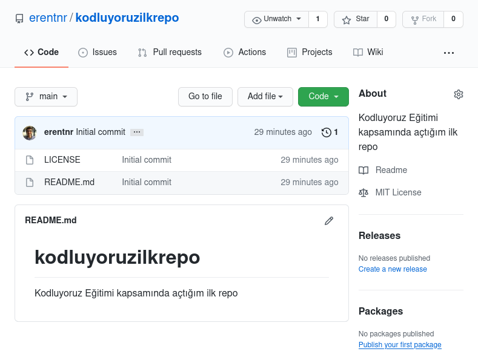

# Kodluyoruz İlk Repo

Bu repo [Patika.dev](https://www.patika.dev/) Node.js ile Backend Patikası için oluşturduğumuz ilk repo. İçerisinde bir adet README dosyası barındırıyor.



## Installation

Öncelikle projeyi clonelayın.

`git clone git@github.com:erentnr/kodluyoruzilkrepo.git`

## Usage

Projeyi cloneladıktan bir metin editöründe açınız.

Linux üzerinde Atom için:

```
cd kodluyoruzilkrepo
atom .
```

## Contributing

Pull requestler kabul edilir. Büyük değişiklikler için, lütfen önce neyi değiştirmek istediğinizi tartışmak için bir konu açınız.

## License

[MIT](https://choosealicense.com/licenses/mit/)
